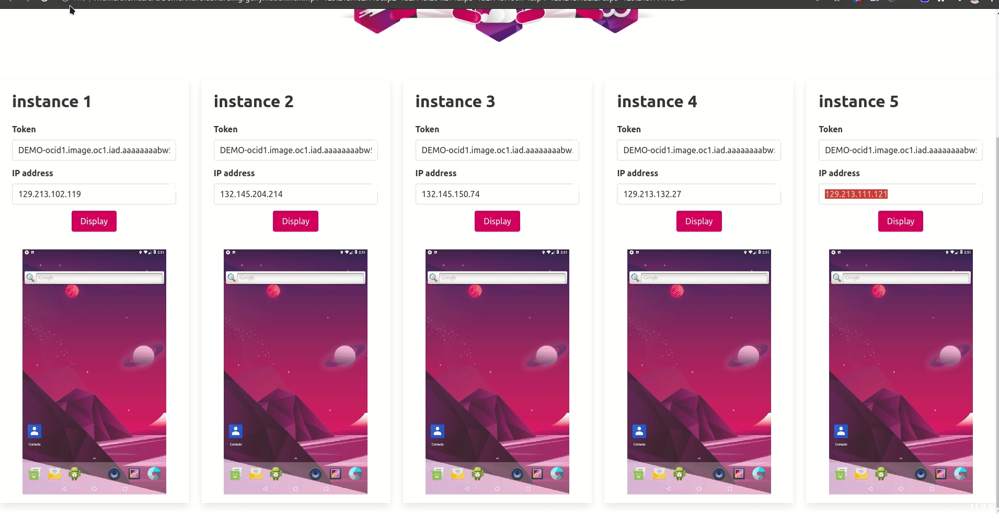

# How to scale your Android tests using Genymotion Device Image on Oracle Cloud Platform

## Description 

This is the source code of the demo I've done during [Better and Faster E2E Testing of Android Apps on Genymotion ARM Virtual Devices on Oracle Cloud webinar](https://www.youtube.com/watch?v=Rgrf0doD6yM). 

You will be able to start several [Genymotion Device Image](https://www.genymotion.com/) on [Oracle Cloud](http://bit.ly/trial-211117)

## Start Genymotion Device Image 

I manage my Oracle Cloud infrastructure with Terraform. For more information about the installation and usage, please refer to the [documentation](https://learn.hashicorp.com/collections/terraform/oci-get-started)


1. Go to `oracle` folder
2. Modify `variables.tf` to match with your own Oracle variables.
3. Run Terraform : 
```shell
terraform apply --var oci-image=ocid1.image.oc1.iad.aaaaaaaabw5mcng36w3kifzdeqdvkvn5vfh2bubwy74nkyizfuzjanvguunq --var instance_shape=VM.Standard.A1.Flex
```
4. Connect the instances through ADB: 
```shell
./connect_to_adb.sh
```

## Run tests

1. You need to install [appium](https://appium.io)
2. Start Appium server in a terminal:
 ```
 appium 
 ```
3. Install python dependencies
```
pip install -r requirements.txt
```
4. Update `pytest.ini` and replace [IP_DEVICE] with ADB SERIAL of each devices:
```
--tx popen//env:ADB_SERIAL=[IP_DEVICE_1]:5555//env:systemPort=8201
--tx popen//env:ADB_SERIAL=[IP_DEVICE_2]:5555//env:systemPort=8202
--tx popen//env:ADB_SERIAL=[IP_DEVICE_3]:5555//env:systemPort=8203
--tx popen//env:ADB_SERIAL=[IP_DEVICE_4]:5555//env:systemPort=8204
--tx popen//env:ADB_SERIAL=[IP_DEVICE_5]:5555//env:systemPort=8205
```

### Genymotion Device Javascript SDK

For this demo, I've also created an HTML page using [Genymotion Device Player Javascript SDK](https://github.com/Genymobile/genymotion-device-web-player). It provides an easy way to integrate Genymotion devices running in the cloud into any web application. You will be able to display an emulator screen and interact with the device.

1. Open the link in the output of the connect_to_adb.sh script (replace IP address if needed), ex: 
```
file:///home/thomas/src/DemoAndroidSharding/oracle/../genymotion.html?ip1=150.136.72.58&ip2=193.122.140.10&ip3=132.145.151.13&ip4=132.145.205.7&ip5=150.136.229.48&
```
2. Per default, Genymotion Device Image has no SSL certificate, you need to open each urls in your browser to accept the SSL warning.
3. Go back to the Demo HTML page and click on the `DISPLAY` button. 


### Parallel Method

With Parallel method, you will run all tests on each instance. Here we have 5 tests, so all the 5 tests will run on those 5 instances. 

1. You need to configure pytest modifying `pytest.ini`: 
--dist=each

2. Run tests : 
```
pytest . 
```
3. Results: 
```
25 passed in 73.90s (0:01:13)
```


### Sharding Method

With Sharding method, you will dispatch all tests on all instances. Here we have 5 tests and we have 5 instances, so 1 test will run per instance. 

1. You need to configure pytest modifying `pytest.ini`: 
--dist=load

2. Run tests : 
```
pytest . 
```
3. Results: 
```
5 passed in 16.20s
```



## Stop Genymotion Device Image

1. Go to `oracle` folder
2. Run Terraform : 
```shell
terraform apply --var oci-image=ocid1.image.oc1.iad.aaaaaaaabw5mcng36w3kifzdeqdvkvn5vfh2bubwy74nkyizfuzjanvguunq --destroy
```